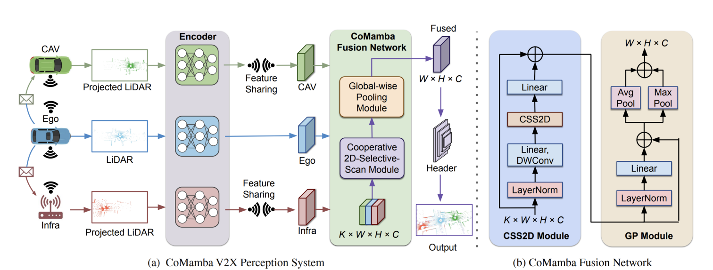

<!--
 * @Descripttion: 
 * @version: 
 * @Author: Jinlong Li  PhD
 * @Date: 2024-09-20 09:50:59
 * @LastEditors: Jinlong Li  PhD
 * @LastEditTime: 2024-09-20 14:54:01
-->


# CoMamba: Real-time Cooperative Perception Unlocked with State Space Models


[](https://opensource.org/licenses/MIT)
[](https://arxiv.org/abs/2409.10699) 

This [paper](https://arxiv.org/abs/2409.10699)  introduce a novel attention-free, state space model-based framework called CoMamba for V2X-based perception. CoMamba scales remarkably well, achieving linear-complexity costs in GFLOPs, latency, and GPU memory relative to the number of agents, while still maintaining excellent perception performance. 


## [Project Page](https://jinlong17.github.io/CoMamba/)
<p align="center">

</p>


## Data Download

<!-- All the data can be downloaded from [google drive](https://drive.google.com/drive/folders/1dkDeHlwOVbmgXcDazZvO6TFEZ6V_7WUu). If you have a good internet, you can directly download the complete large zip file such as `train.zip`. In case you suffer from downloading large files, we also split each data set into small chunks, which can be found in the directory ending with `_chunks`, such as `train_chunks`. After downloading, please run the following command to each set to merge those chunks together:
```python
cat train.zip.part* > train.zip
unzip train.zip
``` -->
We conducted extensive experiments on three multi-agent datasets: OPV2V, V2XSet, and V2V4Real.
  - [x] [OPV2V [ICRA2022]](https://mobility-lab.seas.ucla.edu/opv2v/)
  - [x] [V2XSet [ECCV2022]](https://github.com/DerrickXuNu/v2x-vit)
  - [x] [V2V4Real [CVPR2023]](https://github.com/ucla-mobility/V2V4Real)


## Quick Start

- We provide a [conda env file](environment.yml) for environment setup. 
```bash
conda env create -f environment.yml
conda activate comamba
```
- please refer to [installation](https://opencood.readthedocs.io/en/latest/md_files/installation.html) guide to  install OpenCOOD. 
- If yo have any issues, please refer the installation of [OpenCOOD](https://github.com/DerrickXuNu/OpenCOOD) and [VMamba](https://github.com/MzeroMiko/VMamba).


### Training  

OpenCOOD uses yaml file to configure all the parameters for training. To train your own model from scratch or a continued checkpoint, run the following commonds:
```python
CUDA_VISIBLE_DEVICES=0 python opencood/tools/train.py --hypes_yaml opencood/hypes_yaml/point_pillar_opv2v_comamba.yaml  [--model_dir  ${CHECKPOINT_FOLDER} --half]
```
Arguments Explanation:
- `hypes_yaml`: the path of the training configuration file, e.g. `opencood/hypes_yaml/second_early_fusion.yaml`, meaning you want to train
an early fusion model which utilizes SECOND as the backbone. See [Tutorial 1: Config System](https://opencood.readthedocs.io/en/latest/md_files/config_tutorial.html) to learn more about the rules of the yaml files.
- `model_dir` (optional) : the path of the checkpoints. This is used to fine-tune the trained models. When the `model_dir` is
given, the trainer will discard the `hypes_yaml` and load the `config.yaml` in the checkpoint folder.
- `half` (optional): If set, the model will be trained with half precision. It cannot be set with multi-gpu training togetger.


### Testing
Before you run the following command, first make sure the `validation_dir` in config.yaml under your checkpoint folder
refers to the testing dataset path, e.g. `opv2v_data_dumping/test`.

```python
CUDA_VISIBLE_DEVICES=0 python opencood/tools/inference.py --model_dir ${CHECKPOINT_FOLDER} --fusion_method ${FUSION_STRATEGY} [--show_vis] [--show_sequence]
```
Arguments Explanation:
- `model_dir`: the path to your saved model.
- `fusion_method`: indicate the fusion strategy, currently support 'early', 'late', and 'intermediate'.
- `show_vis`: whether to visualize the detection overlay with point cloud.
- `show_sequence` : the detection results will visualized in a video stream. It can NOT be set with `show_vis` at the same time.
- `global_sort_detections`: whether to globally sort detections by confidence score. If set to True, it is the mainstream AP computing method, but would increase the tolerance for FP (False Positives). **OPV2V paper does not perform the global sort.** Please choose the consistent AP calculation method in your paper for fair comparison.

The evaluation results  will be dumped in the model directory. 


## Citation
If you are using our work for your research, please cite the following paper:
 ```bibtex
  @article{li2024comamba,
    title={CoMamba: Real-time Cooperative Perception Unlocked with State Space Models},
    author={Li, Jinlong and Liu, Xinyu and Li, Baolu and Xu, Runsheng and Li, Jiachen and Yu, Hongkai and Tu, Zhengzhong},
    journal={arXiv preprint arXiv:2409.10699},
    year={2024}
  }
```
## Acknowledgment

This code is modified based on the code [OpenCOOD](https://github.com/DerrickXuNu/OpenCOOD) and [VMamba](https://github.com/MzeroMiko/VMamba). Thanks.
